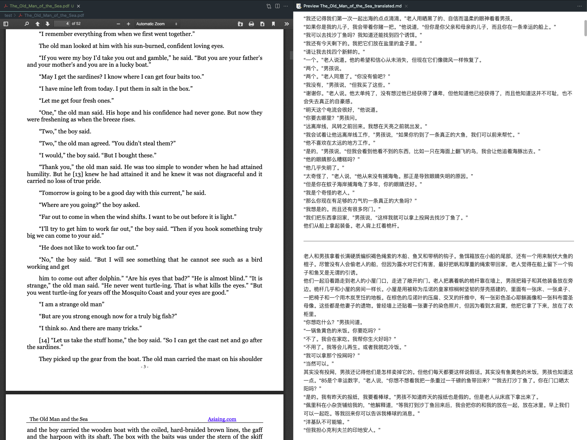
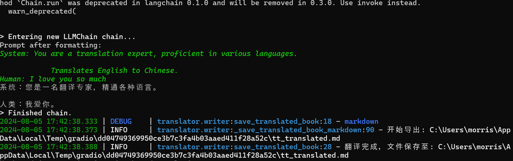

# OpenAI-Translator

<p align="center">
    <br> English | <a href="README-CN.md">中文</a>
</p>
<p align="center">
    <em>All the code and documentation are entirely generated by OpenAI's GPT-4 Model</em>
</p>


## Introduction

OpenAI Translator is an AI-powered translation tool designed to translate English PDF books to Chinese. The tool leverages large language models (LLMs) like ChatGLM and OpenAI's GPT-3 and GPT-3.5 Turbo for translation. It's built in Python and has a flexible, modular, and object-oriented design. 

## Why this project

In the current landscape, there's a lack of non-commercial yet efficient PDF translation tools. Many users have PDF documents with sensitive data that they prefer not to upload to public commercial service websites due to privacy concerns. This project was developed to address this gap, providing a solution for users who need to translate their PDFs while maintaining data privacy.

### Sample Results

The OpenAI Translator is still in its early stages of development, and I'm actively working on adding more features and improving its performance. We appreciate any feedback or contributions!



<p align="center">
    <em>"The Old Man and the Sea"</em>
</p>

## Features

- [X] Translation of English PDF books to Chinese using LLMs.
- [X] Support for both [ChatGLM2-6B](https://github.com/THUDM/ChatGLM-6B) models.
- [X] Flexible configuration through a YAML file or command-line arguments.
- [X] Timeouts and error handling for robust translation operations.
- [X] Modular and object-oriented design for easy customization and extension.
- [x] Add support for other languages and translation directions.
- [x] Implement a graphical user interface (GUI) for easier use.


## Getting Started

### Environment Setup

1.Clone the repository `git@github.com:waimorris/ChatGLM_Translate.git`.

2.The `OpenAI-Translator` requires Python 3.10 or later. Install the dependencies with `pip install -r requirements.txt`.


### Usage

 run the tool:

```bash
python ai_translator/gradio_server
```




## GPU Inference 
To use GPU, set device=0 in the ChatGLMPipeline.from_model_id() call.

chat = ChatGLMPipeline.from_model_id(
 model_id="THUDM/chatglm2-6b",
 device=0,  # Use 0 for GPU, -1 for CPU
 model_kwargs={"temperature": 0, "max_length": 5000, "trust_remote_code": True},
 callback_manager=callback_manager, 
 verbose=True,
)

